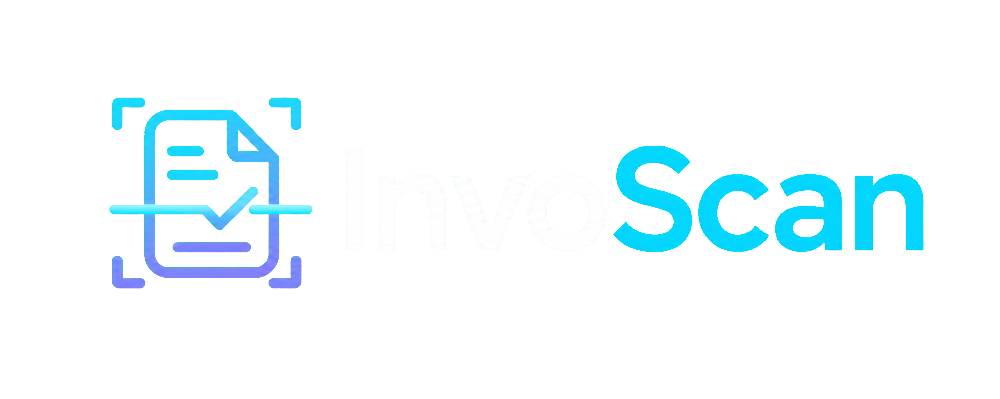

# InvoScan



InvoScan is a local web application for extracting structured data from handwritten Indian bills and comparing vision-language models on field accuracy, latency, and estimated cost. It supports bill upload, side-by-side extraction, human-entered ground truth, field-level scoring, reports, JSON/CSV export, and optional Zoho Books expense creation.

## Approach

The application uses a browser interface backed by an Express proxy:

1. A user uploads a JPEG, PNG, or WebP bill image.
2. The server stores the image locally and sends it to each selected vision model. API keys remain on the server and are never exposed to browser JavaScript.
3. Each provider is prompted to return a common JSON schema containing vendor, invoice, date, total, currency, GST, line items, payment method, notes, and confidence.
4. The user reviews the extraction and enters or corrects ground-truth values.
5. InvoScan scores each model per field, aggregates the results, and displays accuracy, latency, and estimated cost.
6. A chosen extraction can optionally be exported to Zoho Books.

The current Nvidia path includes a second text-to-JSON pass when its vision model returns a prose description instead of valid JSON. This improves interoperability but adds latency and uses a second API request.

## Evaluation methodology

The evaluation unit is a field from a bill with human-verified ground truth. Empty fields on both sides are skipped rather than counted as correct.

| Field category | Fields | Correctness rule |
| --- | --- | --- |
| Text | Vendor name, invoice number, GST number | Case-insensitive Levenshtein similarity >= 0.85 |
| Numeric | Total, GST amount, GST rate | Extracted value within 2% of ground truth |
| Date | Invoice date | Exact match after normalizing `/`, `-`, and `.` separators |
| Exact | Currency, payment method | Case-insensitive exact match |

Overall accuracy is calculated as `correct scored fields / total scored fields`. The current ground-truth set contains two synthetic bills. This is useful as a functional check, but it is too small to support a statistically strong production claim. A fuller evaluation should use at least 10-15 diverse bills, multiple handwriting styles, varied lighting and camera angles, and bills containing both present and missing GST fields.

## Recommendation

For the current no-credit prototype, Nvidia Llama 3.2 Vision is the practical choice because it is the only provider that completed the recorded evaluation and it extracted all 17 scored fields correctly. Keep the two-pass prose-to-JSON fallback enabled and require human review before accounting export.

This recommendation is provisional, not evidence that Nvidia is universally the most accurate model. Before production use, rerun the same ground-truth set successfully across every candidate model, expand the dataset, record actual billed usage and latency, and select the model with the best accuracy-cost trade-off. Financial records should always remain human-reviewable.

## Requirements

- Node.js 20.9 or later
- npm
- At least one supported model API key
- Optional Zoho Books OAuth credentials for expense export

The project works with only one configured model. Models without valid keys are disabled in the interface.

## Setup

1. Clone the repository:

   ```bash
   git clone https://github.com/Meenakshi-prog15/InvoScan.git
   cd InvoScan
   ```

2. Install dependencies:

   ```bash
   npm install
   ```

3. Create a local environment file:

   **Windows PowerShell**

   ```powershell
   Copy-Item .env.example .env
   ```

   **macOS/Linux**

   ```bash
   cp .env.example .env
   ```

4. Open `.env` and replace only the keys you intend to use. Leave unavailable providers empty:

   ```env
   GEMINI_API_KEY=
   GROQ_API_KEY=
   OPENROUTER_API_KEY=
   ANTHROPIC_API_KEY=
   OPENAI_API_KEY=
   NVIDIA_API_KEY=your_nvidia_api_key_here

   ZOHO_CLIENT_ID=
   ZOHO_CLIENT_SECRET=
   ZOHO_REFRESH_TOKEN=
   ZOHO_ORGANIZATION_ID=
   ZOHO_DATACENTER=in

   PORT=3001
   ```

5. Start the server:

   ```bash
   npm start
   ```

6. Open [http://localhost:3001](http://localhost:3001).

## Usage

1. Upload a redacted bill image from the **Upload** tab.
2. In **Extract**, select the bill and one or more available models.
3. Confirm the privacy reminder and run extraction.
4. In **Evaluate**, enter human-verified ground truth and score the result.
5. Use **Report** to inspect aggregate accuracy and export JSON or CSV.

## Sample bills

The repository includes two fictional handwritten bills for reproducible testing:

- [`samples/sri-krishna-hotel-bill.png`](samples/sri-krishna-hotel-bill.png) — restaurant receipt with line items, GST, total, and UPI payment.
- [`samples/sri-lakshmi-stores-bill.png`](samples/sri-lakshmi-stores-bill.png) — retail receipt with quantities, rates, GST, and grand total.

These images were created as synthetic test data. Their names, addresses, tax identifiers, transaction details, and signatures are fictional and must not be treated as genuine financial documents.

## Privacy and security

- Never commit `.env`; it is excluded by `.gitignore`.
- `.env.example` contains placeholders only and is safe to commit.
- Never put API keys in `index.html`, `js/config.js`, screenshots, issues, or logs.
- Uploaded bills and results are ignored by Git because they may contain sensitive data.
- Redact phone numbers, bank details, Aadhaar/PAN numbers, and personal names before sending images to external model APIs.
- If a key is ever committed or shared publicly, revoke and replace it immediately.

## Project structure

```text
InvoScan/
|- assets/              Logo and static assets
|- css/                 Application styles
|- js/                  Browser-side UI and evaluation logic
|- server/proxy.js      Express API and provider integrations
|- ground_truth/        Local benchmark ground truth
|- samples/             Synthetic sample bills for testing
|- .env.example         Safe configuration template
|- index.html           Single-page interface
|- package.json         Scripts and dependencies
`- README.md            Project documentation
```

## Limitations

- The current benchmark contains only two synthetic bills.
- Provider availability depends on API keys, credits, quotas, and model lifecycle.
- Configured cost values are estimates and require periodic review.
- Model output can be malformed or incomplete; human validation is required.
- The application is designed for local/demo use and does not yet include authentication, encrypted storage, or multi-user isolation.
